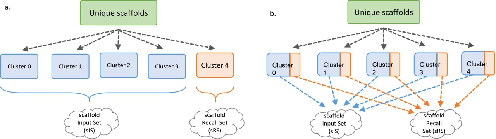
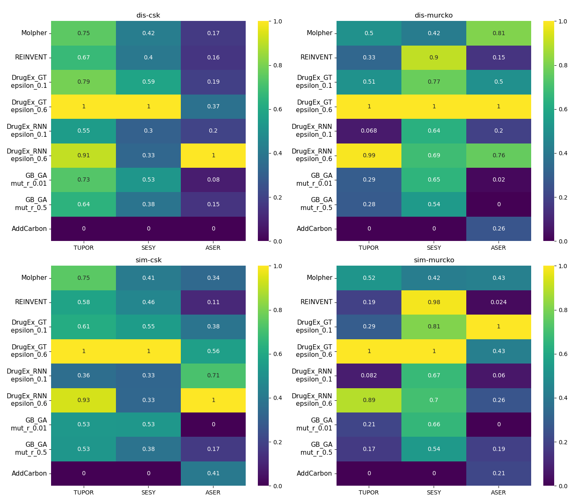
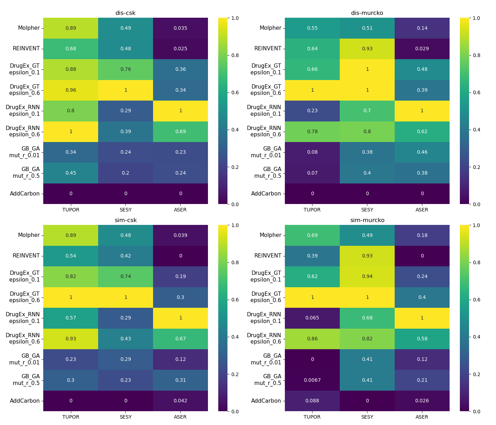
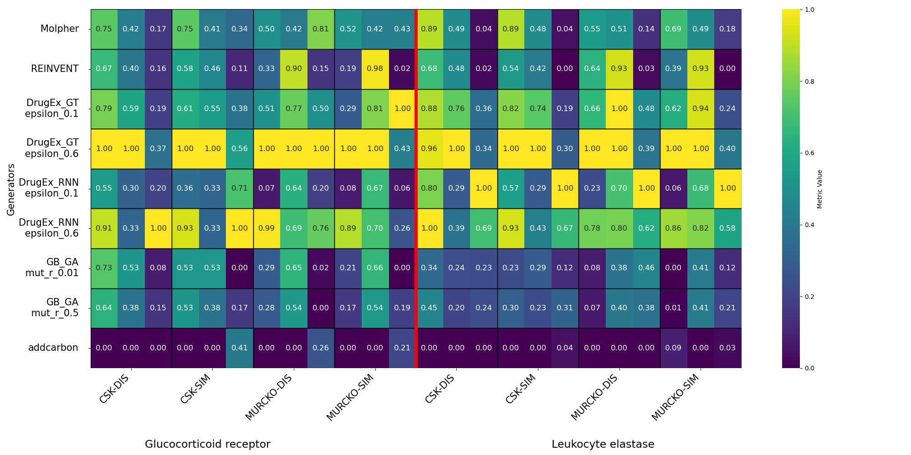

# 📊 Recall Metrics for Molecular Generators

 
**Purpose**: This repository provides an implementation of recall-based metrics — **TUPOR**, **SESY** and **ASER** — for evaluating molecular generators. These metrics help assess the diversity, novelty, and structural relevance of generated compounds.


## 🚀 Features  

Implementation of three key recall metrics:  

### ▪ True positive recall all (TUPOR): 
The number of unique active scaffolds generated for the entire OS (UASo) in the ration to the total number of unique active scaffolds in RS (UASr). Quantifies the recall number of the unique active scaffolds for the entire structure generation process. TUPOR value ranges between 0 (no unique active scaffolds from RS were found in the OS) and 1 (all unique scaffolds from RS were found in the OS).  

   $$TUPOR = {{UASo} \over UASr}$$ 
   
* **Use case** : A high TUPOR value suggests that the model successfully recalls biologically active scaffolds, making it useful for generating molecules with pharmaceutical potential. Users can evaluate the model's accuracy in generating relevant scaffolds for drug discovery. 
### ▪ Set scaffold yield (SESY): 
value for the whole generated set, expressing how many different unique scaffolds (USo) are within their OS size (SSo). This metric reflects the diversity of the generated set by calculating how many different scaffolds are present in the OS. A value of 1 indicates that every scaffold in the OS is unique, while 0 means no valid scaffolds were generated. 

   $$SESY = {{USo} \over SSo}$$ 

* **Use case**: SESY is valuable for users aiming to strike a balance between exploration and exploitation. A high SESY value indicates that the generator explores diverse regions of chemical space by discovering novel scaffolds, which is essential for expanding the chemical space. On the other hand, a low SESY value suggests a focus on exploiting known scaffolds, refining existing chemical structures. By adjusting the SESY, users can fine-tune the generator's ability to either discover new molecular structures (exploration) or optimize known scaffolds (exploitation), depending on the needs of their project. 

### ▪ Absolute set scaffold recall (ASER): 
Absolute set scaffold recall (ASER) – value for the generated dataset expressing the total number of virtual compounds with active scaffold in the OS (cASo) in relation to other scaffolds in OS (SSo). It tells us how effectively the generator is exploring the desired region of chemical space, with higher values reflecting better alignment with biologically relevant scaffolds. 

   $$ASER = {{cASo} \over SSo}$$ 

* **Use case**: A high ASER value indicates that the generator is targeting the most relevant chemical space for drug discovery, creating compounds that are more likely to exhibit biological activity. Users can rely on this metric to assess how well the generator is focusing on biologically active areas of molecular space. 
 

✔ Supports multiple molecular generators: **Molpher, REINVENT, DrugEx, GB_GA, and AddCarbon**.  
✔ Works with **Murcko and CSK scaffold analysis**.  
✔ Normalization and visualization tools for result interpretation.  

In this analyze we prepare data for two different receptors (Glucocorticoid receptor, Leukocyte elastase) and two different split (dissimilarity split and similalrity split)

---

## 📥 Installation  

To use the recall metrics, clone this repository and install the required dependencies:  

```bash
git clone https://github.com/filvaleriia/recall_metrics.git
cd recall_metrics
pip install -r requirements.txt
```


## 🛠 Usage  

### 1️⃣ Running Metric Calculations  

Modify the `calculate_metrics` function in your notebook or script to specify:  

- **Scaffold type**: `csk` or `murcko`  
- **Target receptor**  
- **Molecular generator**  


To use these metrics as explained below, you need to save your OutputSet to the folder. The Output must have only one column with smiles, without header.
*/data/output_sets/{receptor_name}/{generator_name}/cOS_{generator_name}_{type_cluster}_{number_of_cluster}_one_column.csv.*

After that, you can simply use the generator name.
The results can be found in the folder */data/results/{receptor_name}/{generator_name}/*

Example usage in a jupyter notebook:  

```python
from src import metrics

type_cluster = 'dis' #options: 'dis'|'sim' 
scaffold_type = 'csk' #options: 'csk'|'murcko'
generator = 'Molpher' #options: 'Molpher'|'DrugEx'|'REINVENT'|'addcarbon' etc.
receptor = 'Glucocorticoid_receptor' #options: 'Glucocorticoid_receptor'|'Leukocyte_elastase'
ncpus = 4

mt = metrics.Metrics(type_cluster, scaffold_type, generator, receptor,  ncpus)
result = mt.calculate_metrics()
```

Example usage in bash or you can look for examples run_calculation_metrics.sh:
```bash
python3 src/metrics.py --type_cluster dis --scaffold_type csk --generator Molpher --receptor Glucocorticoid_receptor  --num_cpu 3 

```

The second options how use generator it define the path to folder where Recall Set and Output Set or you can look for examples run_calculation_metrics_define_path.sh. The results can be found in the folder */data/results/{receptor_name}/{generator_name}/*

```bash
python3 src/metrics_define_path.py \
    --type_cluster sim \
    --type_scaffold csk \
    --generator Molpher_125k \
    --receptor Glucocorticoid_receptor \
    --recall_set_path /recall_metrics/data/input_recall_sets/Glucocorticoid_receptor \
    --output_set_path /recall_metrics/data/output_sets/Glucocorticoid_receptor/Molpher_125k \
    --ncpus 1
```

The last options how it run, you can use your own data, for this purpose existing script src/metrics_own_data.py or you can loock for examples run_own_single_metrics_calculation.sh, the results will be in results folder in main folder:
```bash
python3 src/metrics_own_data.py \
    --type_scaffold csk \
    --generator Molpher_125k \
    --recall_set_path /recall_metrics/data/input_recall_sets/Glucocorticoid_receptor/cIS_Glucocorticoid_receptor_dis_0.csv \
    --output_set_path /recall_metrics/data/output_sets/Glucocorticoid_receptor/Molpher_62.5k/cOS_Molpher_62.5k_dis_1_one_column.csv \
    --ncpus 1
```

##  🔬⚙️ Project overview  
In this project, we applied three metrics to compare different molecular generators as well as different generator settings in the optimization process.  
To demonstrate the target independence of these metrics, we selected two pharmacological targets and evaluated five molecular generators:

1. **Molpher** – atom-based molecular generator using an evolutionary strategy  
2. **DrugEx** – neural network–based generator. Two architectures and two different epsilon parameter settings (affecting exploration vs. exploitation) were applied:  
   - DrugEx RNN  
   - DrugEx GT  
3. **REINVENT** – neural network–based generator using a pretrained model  
4. **GB_GA** – atom-based generator using a genetic algorithm. Two different mutation_rate parameters were tested (1% and 50%)  
5. **AddCarbon** – baseline generator for result verification  

To cover different structural aspects, we employed two scaffold definitions: **CSKs** and **Murcko scaffolds** (RDKit definition).

For data preparation, we retrieved compounds from **ChEMBL31** for the *Glucocorticoid receptor (GR)* and *Leukocyte elastase (LE)*, selecting only active molecules using activity thresholds (<=100 nM for GR, <=1000 nM for LE).  
The compounds were converted to CSKs and clustered into five groups. From these clusters, we constructed an **Input Set (IS)** and a **Recall Set (RS)** using two approaches:  
- *dissimilarity split (a)*  
- *similarity split (b)*  



The rationale was to explore metric limitations:  
- **Similarity split** → IS and RS are structurally close (upper limit of the metric).  
- **Dissimilarity split** → IS and RS are structurally distant (lower limit of the metric).  

In total, we created **10 different sets** (5 for dissimilarity and 5 for similarity). Each generator was run with the IS to produce corresponding **Output Sets (OS)**.  
Metrics were calculated for each OS using the RS. To avoid bias from outliers or unusual generator behavior, the results were averaged across the five runs.  

Finally, we compared the average metric values across the two split strategies, the two targets, and the two scaffold definitions. For visualization, we prepared normalized heatmaps.  


## 📊 Results  

Here we summarize the main outcomes of our study.  

**Normalized heatmaps for Glucocorticoid receptor**  


**Normalized heatmaps for Leukocyte elastase**  


**Combined normalized results in a single overview plot**  


Based on these results, the best performance of our metrics was achieved by **DrugEx Graph Transformer** with *epsilon = 0.6*.  
The weakest performance was observed for the **AddCarbon** generator.