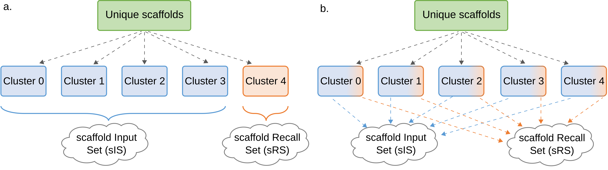
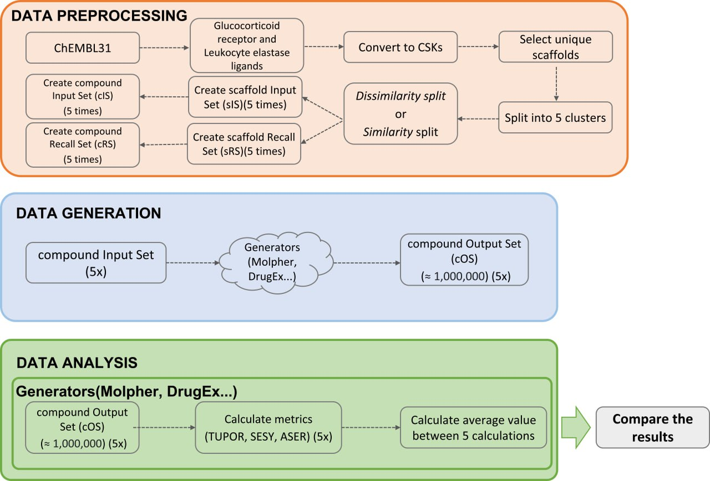
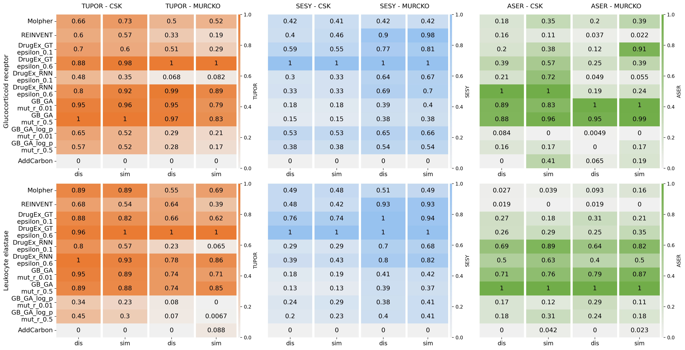

# 📊 Scaffold-based Metrics for Molecular Generators

 
**Purpose**: This repository provides an implementation of recall-based metrics — **TUPOR**, **SESY** and **ASER** — for evaluating molecular generators. These metrics help assess the diversity, novelty, and structural relevance of generated compounds.


## 🚀 Features  

Implementation of three key recall metrics:  

### ▪ TrUe POsitive Recall all (TUPOR): 
quantifies the ability of the generator to produce molecules containing scaffolds that occur in biologically active compounds. It is calculated as the ratio of the number of unique active scaffolds in the Output Set (OS) (UAs<sub>OS</sub>) to the number of unique active scaffolds in the Recall Set (RS)  (UAS<sub>RS</sub>). TUPOR value ranges between 0 (no unique active scaffolds from RS were found in the OS) and 1 (all unique active scaffolds from RS were found in the OS).

   $$TUPOR = {{UAs_{OS}} \over UAs_{RS}}$$ 
   
* The TUPOR metric is a key measure that quantifies the ability of a molecular generator to reproduce biologically active scaffolds. As such TUPOR is analogous to the recall metric used to evaluate classification tasks in machine learning.

### ▪ SEt Scaffold Yield (SESY): 
reflects the structural diversity of the generated set. It is calculated as the percentage of unique scaffolds (Us<sub>OS</sub>) in the Output Set relative to the total number of compounds in the output set (c<sub>OS</sub>) in the output set. A value of 1 indicates that every scaffold in the OS is unique, while 0 means no valid scaffolds were generated. 

   $$SESY = {{Us_{OS}} \over c_{OS}}$$ 

* SESY enables striking a balance between exploration and exploitation. A high SESY value indicates that the generator explores diverse regions of chemical space by discovering novel scaffolds, which is essential for expanding the chemical space. On the other hand, a low SESY value suggests a focus on exploiting similar scaffolds, refining specific chemical structures. Adjusting the generator parameters based on the SESY value enables fine-tuning the balance between exploring diverse molecular structures and exploiting specific scaffolds. 

### ▪ Absolute SEt Scaffold Recall (ASER): 
indicates how effectively the generator explores the target region of chemical space. It is calculated as the ratio of the number of virtual compounds in the OS that contain an active scaffold (cAs<sub>OS</sub>) to the total number of compounds in the Output Set (c<sub>OS</sub>).The ASER metric starts at 0, indicating that no generated compounds in the output set (OS) contain an active scaffold. Higher ASER values reflect an increasing frequency of active scaffolds within the generated compounds. Importantly, the metric can exceed 1 because some compounds may contain multiple active scaffolds. In this sense, it is akin to the precision metric that is used to evaluate classification tasks in machine learning. 

   $$ASER = {{cAS_{OS}} \over c_{OS}}$$ 

* A higher ASER value means the generator is better at making molecules similar to those known to be biologically active. This suggests that the generator is exploring the right chemical space for drug discovery—outside of what it already is trained upon. 
 

✔ Supports multiple molecular generators: **Molpher, REINVENT, DrugEx, GB_GA, and AddCarbon**.  
✔ Works with **Murcko and CSK scaffold analysis**.  
✔ Normalization and visualization tools for result interpretation.  

In this analyze we prepare data for two different receptors (Glucocorticoid receptor, Leukocyte elastase) and two different split (dissimilarity split and similalrity split)

---

## 📥 Installation  

To use the scaffold-based metrics, clone this repository and install the required dependencies:  

```bash
git clone https://github.com/filvaleriia/scaffold-based-metrics.git
cd scaffold-based-metrics
conda env create -f environment.yml
conda activate scaffold-based-metrics-env
```

OR packages what you need to install:
- rdkit
- pandas
- JupyterLab
- scikit-learn
- scikit-learn-extra
- seaborn
- matplotlib


## 🛠 Usage  

### 1️⃣ Running Metric Calculations  

Modify the `calculate_metrics` function in your notebook or script to specify:  

- **Scaffold type**: `csk` or `murcko`  
- **Target receptor**  
- **Molecular generator**  


To use these metrics as explained below, you need to save your OutputSet to the folder. The Output must have only one column with smiles, without header.
*/data/output_sets/{receptor_name}/{generator_name}/cOS_{generator_name}_{type_cluster}_{number_of_cluster}_one_column.csv.*

After that, you can simply use the generator name.
The results can be found in the folder */data/results/{receptor_name}/{generator_name}/*

Example usage in a jupyter notebook:  

```python
from src import metrics

type_cluster = 'dis' #options: 'dis'|'sim' 
type_scaffold = 'csk' #options: 'csk'|'murcko'
generator = 'Molpher' #options: 'Molpher'|'DrugEx'|'REINVENT'|'addcarbon' etc.
receptor = 'Glucocorticoid_receptor' #options: 'Glucocorticoid_receptor'|'Leukocyte_elastase'
ncpus = 4

mt = metrics.Metrics(type_cluster, type_scaffold, generator, receptor,  ncpus)
result = mt.calculate_metrics()
```

Example usage in bash or you can look for examples run_calculation_metrics.sh:
```bash
python3 src/metrics.py --type_cluster dis --type_scaffold csk --generator Molpher --receptor Glucocorticoid_receptor  --num_cpu 3 

```

The second options how use generator it define the path to folder where Recall Set and Output Set or you can look for examples run_calculation_metrics_define_path.sh. The results can be found in the folder */data/results/{receptor_name}/{generator_name}/*

```bash
python3 src/metrics_define_path.py \
    --type_cluster sim \
    --type_scaffold csk \
    --generator Molpher_125k \
    --receptor Glucocorticoid_receptor \
    --recall_set_path /recall_metrics/data/input_recall_sets/Glucocorticoid_receptor \
    --output_set_path /recall_metrics/data/output_sets/Glucocorticoid_receptor/Molpher_125k \
    --ncpus 1
```

The last options how it run, you can use your own data, for this purpose existing script src/metrics_own_data.py or you can loock for examples run_own_single_metrics_calculation.sh, the results will be in results folder in main folder:
```bash
python3 src/metrics_own_data.py \
    --type_scaffold csk \
    --generator Molpher_125k \
    --recall_set_path /recall_metrics/data/input_recall_sets/Glucocorticoid_receptor/cRS_Glucocorticoid_receptor_dis_0.csv \
    --output_set_path /recall_metrics/data/output_sets/Glucocorticoid_receptor/Molpher_62.5k/cOS_Molpher_62.5k_dis_0_one_column.csv \
    --ncpus 1
```

##  🔬⚙️ Project overview  
In this project, we applied three metrics to compare different molecular generators as well as different generator settings in the optimization process.  
To demonstrate the target independence of these metrics, we selected two pharmacological targets and evaluated five molecular generators:

1. **Molpher** – atom-based molecular generator using an evolutionary strategy  
2. **DrugEx** – neural network–based generator. Two architectures and two different epsilon parameter settings (affecting exploration vs. exploitation) were applied:  
   - DrugEx RNN  
   - DrugEx GT  
3. **REINVENT** – neural network–based generator using a pretrained model  
4. **GB_GA** – atom-based generator using a genetic algorithm. Two different mutation_rate parameters were tested (1% and 50%)  
5. **AddCarbon** – baseline generator for result verification  

To cover different structural aspects, we employed two scaffold definitions: **CSKs** and **Murcko scaffolds** (RDKit definition).

For data preparation, we retrieved compounds from **ChEMBL31** for the *Glucocorticoid receptor (GR)* and *Leukocyte elastase (LE)*, selecting only active molecules using activity thresholds (<=100 nM for GR, <=1000 nM for LE).  
The compounds were converted to CSKs and clustered into five groups. From these clusters, we constructed an **Input Set (IS)** and a **Recall Set (RS)** using two approaches:  
- *dissimilarity split (a)*  
- *similarity split (b)*  




The rationale was to explore metric limitations:  
- **Similarity split** → IS and RS are structurally close (upper limit of the metric).  
- **Dissimilarity split** → IS and RS are structurally distant (lower limit of the metric).  

In total, we created **10 different sets** (5 for dissimilarity and 5 for similarity). Each generator was run with the IS to produce corresponding **Output Sets (OS)**.  
Metrics were calculated for each OS using the RS. To avoid bias from outliers or unusual generator behavior, the results were averaged across the five runs.  

Finally, we compared the average metric values across the two split strategies, the two targets, and the two scaffold definitions. For visualization, we prepared normalized heatmaps.




## 📊 Results  

Here we summarize the main outcomes of our study.  

**Combined normilazid results in a single overview plot**  


Based on these results, the best performance of our metrics was achieved by **DrugEx Graph Transformer** with *epsilon = 0.6*.  
The weakest performance was observed for the **AddCarbon** generator.