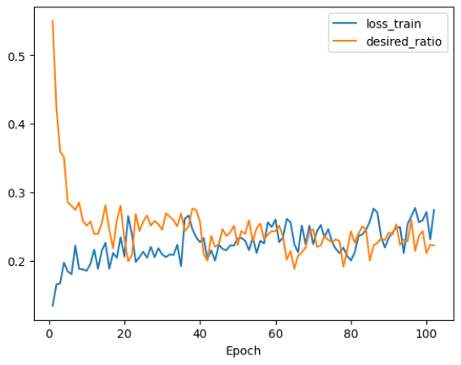
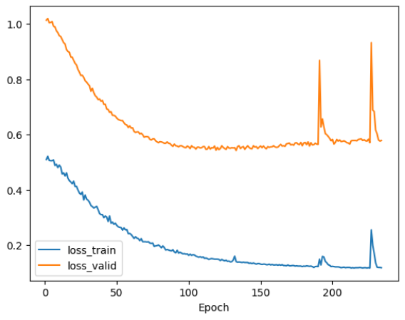

# Molecular Generator DrugEx_GT

Molecular generator DrugEx with Graph Transformer

- 📄 **Publications**: [DrugEx GT Publication](https://jcheminf.biomedcentral.com/articles/10.1186/s13321-023-00694-z)
- 💻 **GitHub**: [DrugEx GitHub Repository](https://github.com/CDDLeiden/DrugEx)

---

## 🛠️ Installation

Before running the generator, make sure to install all required dependencies and clone DrugEx from GitHub.

## 🔄 DrugEx Steps

DrugEx follows the following steps:

1. **Encoding** 
2. **Fine-tuning**
3. **Creating an environment with scoring functions**
4. **Reinforcement Learning**
5. **Generating compounds**

All of these steps are implemented in the `drugex_gt.py` script. Inside the script, you need to adjust the paths and provide the names for the cluster type, cluster number, and receptor name.

---

## 🖥️ Running DrugEx

To run DrugEx, you need a pretrained model, such as the `Papyrus05.5_graph_trans_PT` model (you can download in https://zenodo.org/records/7085421), or you can use your own pretrained model.

```bash
python3 drugex_gt.py
```
---
## ⚙️ Parameters

During the process, you can set the following parameters:

- `n_epochs`
- `patience`
- `batch_size`
- `gpus`
- `agent`
- `mutate`

**Recommended setting**: It is recommended to set the parameters in the following order:
- `agent = finetuned`, `mutate = pretrained`

This order is important because if the order is changed, the training process will not proceed correctly. Refer to the image below for clarification:

### Agent = finetuned, Mutate = pretrained



### Agent = pretrained, Mutate = finetuned



---

## ⚡ Epsilon Parameter

- The `epsilon` parameter controls the influence from the mutate network. The larger this parameter, the greater the influence from the mutate network on the process.
