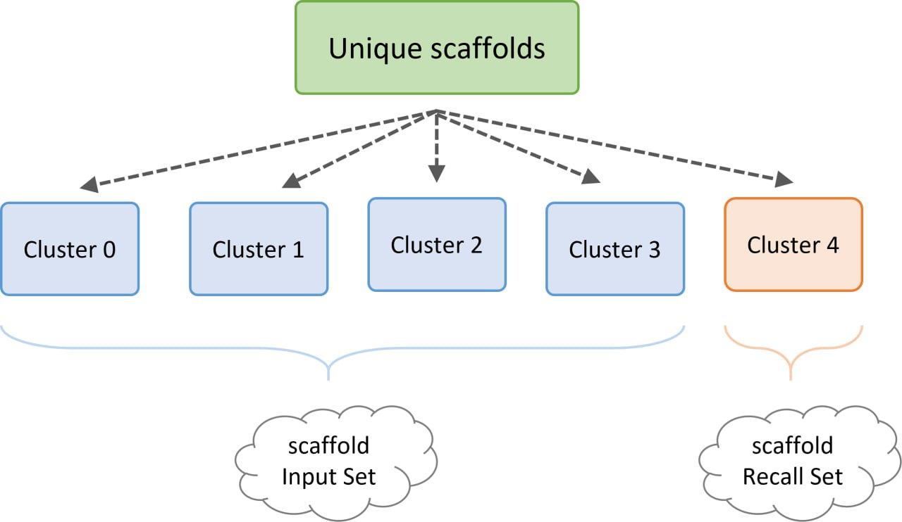
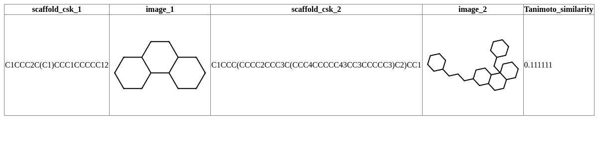
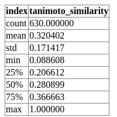
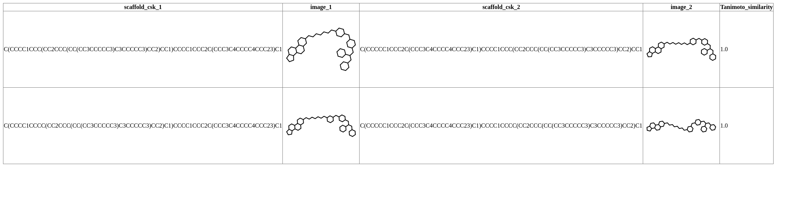
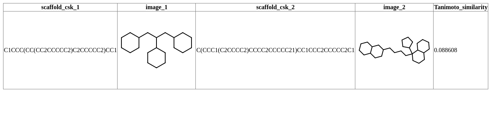
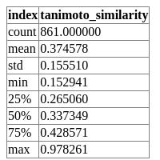
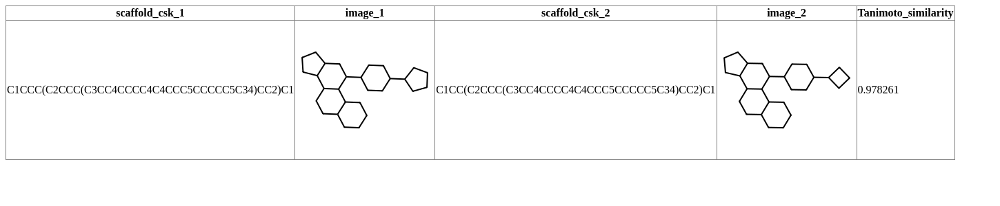
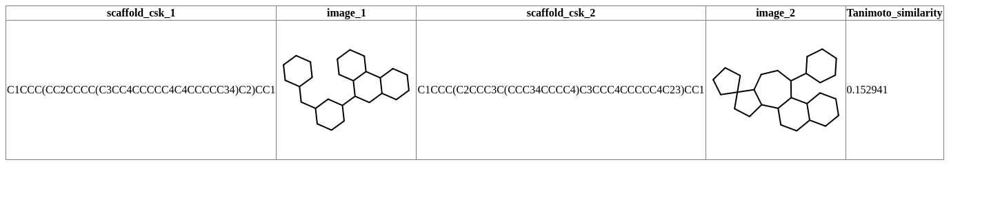
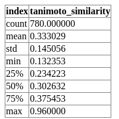
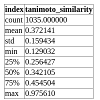

- [Important informations:](#important-informations)
- [Important shortcuts](#important-shortcuts)
- [Metrics](#metrics)
- [Project](#project)
- [Glucocorticoid receptor](#glucocorticoid-receptor)
  - [Dissimilarity split](#dissimilarity-split)
    - [CSK scaffold](#csk-scaffold)
      - [1. Molpher](#1-molpher)
      - [2. DrugEx](#2-drugex)
      - [3. Compare more generators CSK scaffold](#3-compare-more-generators-csk-scaffold)
    - [Murcko scaffold](#murcko-scaffold)
      - [1. Molpher](#1-molpher-1)
      - [2. DrugEx](#2-drugex-1)
      - [3. Compare more generators Murcko scaffold](#3-compare-more-generators-murcko-scaffold)
  - [Similarity split](#similarity-split)
    - [CSK scaffold](#csk-scaffold-1)
      - [1. Molpher](#1-molpher-2)
      - [2. DrugEx](#2-drugex-2)
      - [3. Compare more generators CSK scaffold](#3-compare-more-generators-csk-scaffold-1)
    - [Murcko scaffold](#murcko-scaffold-1)
      - [1. Molpher](#1-molpher-3)
      - [2. DrugEx](#2-drugex-3)
      - [3. Compare more generators Murcko scaffold](#3-compare-more-generators-murcko-scaffold-1)
- [Protease: Leukocyte elastase](#protease-leukocyte-elastase)
  - [Dissimilarity split](#dissimilarity-split-1)
    - [CSK scaffold](#csk-scaffold-2)
      - [1. Molpher](#1-molpher-4)
      - [2. DrugEx](#2-drugex-4)
      - [3. Compare more generators CSK scaffold](#3-compare-more-generators-csk-scaffold-2)
    - [Murcko scaffold](#murcko-scaffold-2)
      - [1. Molpher](#1-molpher-5)
      - [2. DrugEx](#2-drugex-5)
      - [3. Compare more generators Murcko scaffold](#3-compare-more-generators-murcko-scaffold-2)
  - [Similarity split](#similarity-split-1)
    - [CSK scaffold](#csk-scaffold-3)
      - [1. Molpher](#1-molpher-6)
      - [2. DrugEx](#2-drugex-6)
      - [3. Compare more generators CSK scaffold](#3-compare-more-generators-csk-scaffold-3)
    - [Murcko scaffold](#murcko-scaffold-3)
      - [1. Molpher](#1-molpher-7)
      - [2. DrugEx](#2-drugex-7)
      - [3. Compare more generators Murcko scaffold](#3-compare-more-generators-murcko-scaffold-3)

# Important informations: 

  
* ChEMBL 31: download 18.1.2023
* conda environment is rdkit-env(conda activate rdkit-env)
* data are download in 22.02.2023
* Used descriptors: Morgan Fingerprint r=3, 2048
* Threshold for nuclear receptor - <0-100> nM
* Threshold for protease - <0-1000> nM
* IC50 - pouzita merena aktivita
* for splitting to 5 clusters used Kmedoids algorithm with Tanimoto distance (because in K-medoids we can change the distance, because in K-means they used Euclidian distance)

# Important shortcuts

* cIS = compound Input Set
* sIS = scaffold Input Set
* cRS = compound Recall Set
* sRS = scaffold Recall Set
* cOS = compound Output Set
* dis = Dissimilarity split
* sim = Similarity split

# Metrics

Here we need to add information about metrics and formula

tRS - count of active compounds which have active scaffold in cOS 
SS - cOS size  
NS - unique new scaffolds in cOS 
NAS - unique active scaffolds in cRS 
UAS - unique scaffods in cRS  

|             | |
|-------------|-|
|▪ True positive recall all (TUPOR) – | $$TUPOR = {{NAS} \over UAS}$$ |
|▪ Set scaffold yield (SESY) –| $$SESY = {{NS} \over SS}$$ |
|▪ Absolute set scaffold recall (ASER) –| $$ASER = {{tRS} \over SS}$$ |

# Project

The goal of the project is to experimentally test the behavior of metrics I have designed for two different molecular generators and compare them with each other. Within the scope of this project, two molecular generators will be tested: DrugEx, which is based on deep learning, and Molpher, which is based on evolutionary algorithms.

<strong> Split into Input Set and Recall Set:</strong>

For splitting data to clusters we convert data to CSK scaffolds and try to split data based the scaffold similarity(tanimoto distance) using K-medoids algorithm  
We divided all data for 5 clusters, and then for "dissimilarity" part we selectd four clusters for sIS and another one to sRS. And we done this five times. Than for creating cIS and cRS we found all compound wich have scaffold in sIS and sRS. 

We divided all data for 5 clusters, and then for "similarity" part we select 20% from each clusters for sRS and other 80% from each cluster for sIS.

Clusters similarity (morgan fingerprint created by CSK scaffold, for calculation similarity using jaccard coefficient(Tanimoto similarity)):

||Cluster_0 |Cluster_1  | Cluster_2 | Cluster_3  | Cluster_4  |
|-------------|-------|-------|-------|---|-|
|Cluster_0| 1.0| 0.292929 | 0.27027| 0.220588|0.411765|
|Cluster_1| 0.292929| 1.0 | 0.237113|0.184783|0.270833|
|Cluster_2| 0.27027| 0.237113 | 1.0|0.315789|0.239437|
|Cluster_3| 0.220588 | 0.184783 | 0.315789|1.0|0.184615|
|Cluster_4| 0.411765 | 0.270833 | 0.239437|0.184615|1.0|

 

  
<strong> For see scaffolds in each cluster click to expand!</strong>

|  cluster 0: |  cluster 1: | 
| ------------ | --- |
|| |

|  cluster 2: |  cluster 3: |
| ------------ | --- |
|| |

|  cluster 4: |  
| ------------ |
|| 

 

  
<strong> For see statistic inside each cluster and Maximal and minimal tanimoto similarity in compounds click to expand!</strong>

  

<strong> Cluster_0:</strong>

|  Statistics: | 
| ------------ | 
||

|  Max_tanimoto: | 
| ------------ | 
|| 

|  Min_tanimoto: | 
| ------------ | 
|| 

  
<strong> Cluster_1:</strong>

|  Statistics: | 
| ------------ | 
||

|  Max_tanimoto: | 
| ------------ | 
|| 

|  Min_tanimoto: | 
| ------------ | 
|| 

  
<strong> Cluster_2:</strong>

|  Statistics: | 
| ------------ | 
||

|  Max_tanimoto: | 
| ------------ | 
|| 

|  Min_tanimoto: | 
| ------------ | 
|| 

  
<strong> Cluster_3:</strong>

|  Statistics: | 
| ------------ | 
||

|  Max_tanimoto: | 
| ------------ | 
|| 

|  Min_tanimoto: | 
| ------------ | 
|| 

  
<strong> Cluster_4:</strong>

|  Statistics: | 
| ------------ | 
||

|  Max_tanimoto: | 
| ------------ | 
|| 

|  Min_tanimoto: | 
| ------------ | 
|| 

  
<strong> All statistics:</strong>

|  cluster 0: |  cluster 1: |  cluster 2: |  cluster 3: |  cluster 4: | 
| ------------ | --- |--- |--- |--- |
|| ||||

# Glucocorticoid receptor

  
Click to expand!

## Dissimilarity split

  

### CSK scaffold

#### 1. Molpher

 I ran 135 022 jobs in the cluster. 

  
For information about runs click to expand!

<strong> Percentage Table for completed/good runs:</strong>

| Name | Ended runs | Percentage |All running runs    | Not good runs|
|-------------|-------|-------|-------|--|
|Cluster_0_dis| 11 039| 41.3% | 26 732|15693|
|Cluster_1_dis| 11 013| 38.3% | 28 730|17717|
|Cluster_2_dis| 11 093| 41.5% | 26 732|15639|
|Cluster_3_dis| 7 755 | 28.3% | 27 389|19634|
|Cluster_4_dis| 5 814 | 22.8% | 25 439|19625

  
For information about time click to expand!

<strong> Table for time for each cluster:</strong>

| Name | Times in hour for good runs| Times for bad runs| 
|-------------|-------|---|
|Cluster_0_dis| 140.3|5230|
|Cluster_1_dis| 92.74|5905|
|Cluster_2_dis| 95.14|5213|
|Cluster_3_dis| 100 |6544|
|Cluster_4_dis| 103 |6541|

<strong>
* Avarage time: 106.236
* Avarage time for bad runs:  20 min
* Avarage time for Molpher running: 5993 hours
</strong>

<strong> Resulting table for dissimilarity split and CSK scaffolds:</strong>

[HTML file with results](data/results/Glucocorticoid_receptor/csk_scaffolds/dis/Molpher/df_all_clusters_with_mean.html)

| name         | type_cluster | scaffold | uniq_scaffolds | set_size    | TUPOR_ | TUPOR     | SESY      | ASER      | tRS     |
| ------------ | ------------ | -------- | -------------- | ----------- | ------ | --------- | --------- | --------- | ------- |
| Molpher_0    | dis          | csk      | 135,545.0      | 1,187,859.0 | 16/42  | 0.3809524 | 0.1141087 | 0.0033868 | 4,023.0 |
| Molpher_1    | dis          | csk      | 132,077.0      | 1,211,203.0 | 18/36  | 0.5       | 0.1090461 | 0.0013293 | 1,610.0 |
| Molpher_2    | dis          | csk      | 137,303.0      | 1,178,785.0 | 12/42  | 0.2857143 | 0.1164784 | 0.0002333 | 275.0   |
| Molpher_3    | dis          | csk      | 116,723.0      | 891,650.0   | 23/40  | 0.575     | 0.1309067 | 0.0077059 | 6,871.0 |
| Molpher_4    | dis          | csk      | 106,618.0      | 707,678.0   | 38/46  | 0.826087  | 0.1506589 | 0.0107182 | 7,585.0 |
| Molpher_mean | dis          | csk      | 125,653.2      | 1,035,435.0 | -      | 0.5135507 | 0.1242398 | 0.0046747 | 4,072.8 |

|   <!-- -->              |    <!-- -->             |    <!-- -->             |
|-------------------------|-------------------------|-------------------------|
|| ||
| ||
| ||
| ||

  
 Two the most common active scaffolds with count:

|  cluster 0: |  cluster 1: | 
| ------------ | --- |
|| |

|  cluster 2: |  cluster 3: |
| ------------ | --- |
|| |

|  cluster 4: |  
| ------------ |
|| 

 

  
 The most common scaffolds (calculation using active and non-active scaffolds):

|  cluster 0: |  cluster 1: | 
| ------------ | --- |
|| |

|  cluster 2: |  cluster 3: |
| ------------ | --- |
|| |

|  cluster 4: |  
| ------------ |
||

#### 2. DrugEx

  
For information about time click to expand!

| Name | Times in hour|
|-------------|-------|
|Cluster_0_dis| 32.16|
|Cluster_1_dis| 34.11|
|Cluster_2_dis| 35.48|
|Cluster_3_dis| 30.7|
|Cluster_4_dis| 32.86|

 
<strong> Avarage time: 33.062 </strong>

<strong> Resulting table for dissimilarity split and CSK scaffolds:</strong>

[HTML file with results](data/results/Glucocorticoid_receptor/csk_scaffolds/dis/DrugEx/df_all_clusters_with_mean.html)

| name        | type_cluster | scaffold | uniq_scaffolds | set_size    | TUPOR_ | TUPOR     | SESY      | ASER      | tRS     |
| ----------- | ------------ | -------- | -------------- | ----------- | ------ | --------- | --------- | --------- | ------- |
| DrugEx_0    | dis          | csk      | 135,545.0      | 1,187,859.0 | 16/42  | 0.3809524 | 0.1141087 | 0.0033868 | 4,023.0 |
| DrugEx_1    | dis          | csk      | 132,077.0      | 1,211,203.0 | 18/36  | 0.5       | 0.1090461 | 0.0013293 | 1,610.0 |
| DrugEx_2    | dis          | csk      | 137,303.0      | 1,178,785.0 | 12/42  | 0.2857143 | 0.1164784 | 0.0002333 | 275.0   |
| DrugEx_3    | dis          | csk      | 116,723.0      | 891,650.0   | 23/40  | 0.575     | 0.1309067 | 0.0077059 | 6,871.0 |
| DrugEx_4    | dis          | csk      | 106,618.0      | 707,678.0   | 38/46  | 0.826087  | 0.1506589 | 0.0107182 | 7,585.0 |
| DrugEx_mean | dis          | csk      | 125,653.2      | 1,035,435.0 | -      | 0.5135507 | 0.1242398 | 0.0046747 | 4,072.8 |

|   <!-- -->              |    <!-- -->             |    <!-- -->             |
|-------------------------|-------------------------|-------------------------|
|| ||
| ||
| ||
| ||

  
 Two the most common active scaffolds with count:

|  cluster 0: |  cluster 1: | 
| ------------ | --- |
|| |

|  cluster 2: |  cluster 3: |
| ------------ | --- |
|| |

|  cluster 4: |  
| ------------ |
|| 

 

#### 3. Compare more generators CSK scaffold

<strong> The resulting table displays calculated all metrics CSK type, type of split data is dis:</strong>

| name         | type_cluster | scaffold | uniq_scaffolds | set_size    | TUPOR_ | TUPOR     | SESY      | ASER      | tRS      |
| ------------ | ------------ | -------- | -------------- | ----------- | ------ | --------- | --------- | --------- | -------- |
| Molpher_mean | dis          | csk      | 125,653.2      | 1,035,435.0 | -      | 0.5135507 | 0.1242398 | 0.0046747 | 4,072.8  |
| DrugEx_mean  | dis          | csk      | 322,088.0      | 999,912.0   | -      | 0.5554555 | 0.3221176 | 0.0127084 | 12,707.4 |

|   <!-- -->              |    <!-- -->             |
|-------------------------|-------------------------|
|| |
| |
| |
| |

<strong> Analyasis KL divergence hits</strong>

|   <!-- -->              |    <!-- -->             |
|-------------------------|-------------------------|-------------------------|
|

### Murcko scaffold

  

#### 1. Molpher

  
For information about runs click to expand!

<strong> Percentage Table for completed/good runs:</strong>

| Name | Ended runs | Percentage |All running runs    | Not good runs|
|-------------|-------|-------|-------|--|
|Cluster_0_dis| 11 039| 41.3% | 26 732|15693|
|Cluster_1_dis| 11 013| 38.3% | 28 730|17717|
|Cluster_2_dis| 11 093| 41.5% | 26 732|15639|
|Cluster_3_dis| 7 755 | 28.3% | 27 389|19634|
|Cluster_4_dis| 5 814 | 22.8% | 25 439|19625

  
For information about time click to expand!

<strong> Table for time for each cluster:</strong>

| Name | Times in hour for good runs| Times for bad runs| 
|-------------|-------|---|
|Cluster_0_dis| 140.3|5230|
|Cluster_1_dis| 92.74|5905|
|Cluster_2_dis| 95.14|5213|
|Cluster_3_dis| 100 |6544|
|Cluster_4_dis| 103 |6541|

<strong>
* Avarage time: 106.236
* Avarage time for bad runs:  20 min
* Avarage time for Molpher running: 5993 hours
</strong>

<strong> Resulting table for dissimilarity split and Murcko scaffolds:</strong>

[HTML file with results](data/results/Glucocorticoid_receptor/murcko_scaffolds/dis/Molpher/df_all_clusters_with_mean.html)

| name         | type_cluster | scaffold | uniq_scaffolds | set_size    | TUPOR_ | TUPOR     | SESY      | ASER      | tRS     |
| ------------ | ------------ | -------- | -------------- | ----------- | ------ | --------- | --------- | --------- | ------- |
| Molpher_0    | dis          | murcko   | 294,677.0      | 1,187,870.0 | 10/101 | 0.0990099 | 0.2480718 | 0.0014143 | 1,680.0 |
| Molpher_1    | dis          | murcko   | 292,568.0      | 1,211,203.0 | 11/49  | 0.2244898 | 0.2415516 | 3.3e-05   | 40.0    |
| Molpher_2    | dis          | murcko   | 298,912.0      | 1,178,796.0 | 4/67   | 0.0597015 | 0.253574  | 0.0001383 | 163.0   |
| Molpher_3    | dis          | murcko   | 236,433.0      | 891,658.0   | 21/83  | 0.253012  | 0.2651611 | 0.0048752 | 4,347.0 |
| Molpher_4    | dis          | murcko   | 201,025.0      | 707,678.0   | 21/108 | 0.1944444 | 0.2840628 | 0.0014385 | 1,018.0 |
| Molpher_mean | dis          | murcko   | 264,723.0      | 1,035,441.0 | -      | 0.1661315 | 0.2584842 | 0.0015799 | 1,449.6 |

|   <!-- -->              |    <!-- -->             |    <!-- -->             |
|-------------------------|-------------------------|-------------------------|
|| ||
| ||
| ||
| ||

  
 Two the most common active scaffolds with count:

|  cluster 0: |  cluster 1: | 
| ------------ | --- |
|| |

|  cluster 2: |  cluster 3: |
| ------------ | --- |
|| |

|  cluster 4: |  
| ------------ |
|| 

 

  
 The most common scaffolds (calculation using active and non-active scaffolds):

|  cluster 0: |  cluster 1: | 
| ------------ | --- |
|| |

|  cluster 2: |  cluster 3: |
| ------------ | --- |
|| |

|  cluster 4: |  
| ------------ |
||

#### 2. DrugEx

  
For information about time click to expand!

| Name | Times in hour|
|-------------|-------|
|Cluster_0_dis| 32.16|
|Cluster_1_dis| 34.11|
|Cluster_2_dis| 35.48|
|Cluster_3_dis| 30.7|
|Cluster_4_dis| 32.86|

 
<strong> Avarage time: 33.062 </strong>

<strong> Resulting table for dissimilarity split and Murcko scaffolds:</strong>

[HTML file with results](data/results/Glucocorticoid_receptor/murcko_scaffolds/dis/DrugEx/df_all_clusters_with_mean.html)

|             |              |          |                |             |        |           |           |           |         |
| ----------- | ------------ | -------- | -------------- | ----------- | ------ | --------- | --------- | --------- | ------- |
| name        | type_cluster | scaffold | uniq_scaffolds | set_size    | TUPOR_ | TUPOR     | SESY      | ASER      | tRS     |
| DrugEx_0    | dis          | murcko   | 693,078.0      | 1,000,000.0 | 14/101 | 0.1386139 | 0.693078  | 0.003156  | 3,156.0 |
| DrugEx_1    | dis          | murcko   | 680,537.0      | 1,000,000.0 | 4/49   | 0.0816327 | 0.680537  | 2.9e-05   | 29.0    |
| DrugEx_2    | dis          | murcko   | 780,801.0      | 1,000,000.0 | 8/67   | 0.119403  | 0.780801  | 0.000216  | 216.0   |
| DrugEx_3    | dis          | murcko   | 704,301.0      | 1,000,000.0 | 14/83  | 0.1686747 | 0.704301  | 0.000588  | 588.0   |
| DrugEx_4    | dis          | murcko   | 685,372.0      | 1,000,000.0 | 33/108 | 0.3055556 | 0.685372  | 0.002277  | 2,277.0 |
| DrugEx_mean | dis          | murcko   | 708,817.8      | 1,000,000.0 | -      | 0.162776  | 0.7088178 | 0.0012532 | 1,253.2 |

|   <!-- -->              |    <!-- -->             |    <!-- -->             |
|-------------------------|-------------------------|-------------------------|
|| ||
| ||
| ||
| ||

  
 Two the most common active scaffolds with count:

|  cluster 0: |  cluster 1: | 
| ------------ | --- |
|| |

|  cluster 2: |  cluster 3: |
| ------------ | --- |
|| |

|  cluster 4: |  
| ------------ |
|| 

 

#### 3. Compare more generators Murcko scaffold

<strong> The resulting table displays calculated all metrics Murcko type, type of split data is dis:</strong>

| name         | type_cluster | scaffold | uniq_scaffolds | set_size    | TUPOR_ | TUPOR     | SESY      | ASER      | tRS     |
| ------------ | ------------ | -------- | -------------- | ----------- | ------ | --------- | --------- | --------- | ------- |
| Molpher_mean | dis          | murcko   | 264,723.0      | 1,035,441.0 | -      | 0.1661315 | 0.2584842 | 0.0015799 | 1,449.6 |
| DrugEx_mean  | dis          | murcko   | 708,817.8      | 1,000,000.0 | -      | 0.162776  | 0.7088178 | 0.0012532 | 1,253.2 |

|   <!-- -->              |    <!-- -->             |
|-------------------------|-------------------------|
|| |
| |
| |
| |

## Similarity split

  

### CSK scaffold

#### 1. Molpher

  
For information about runs click to expand!

<strong> Percentage Table for completed/good runs:</strong>
Change!
| Name | Ended runs | Percentage |All running runs    | Not good runs|
|-------------|-------|-------|-------|--|
|Cluster_0_dis| 11 039| 41.3% | 26 732|15693|
|Cluster_1_dis| 11 013| 38.3% | 28 730|17717|
|Cluster_2_dis| 11 093| 41.5% | 26 732|15639|
|Cluster_3_dis| 7 755 | 28.3% | 27 389|19634|
|Cluster_4_dis| 5 814 | 22.8% | 25 439|19625

  
For information about time click to expand!

<strong> Table for time for each cluster:</strong>
Change!!!
| Name | Times in hour for good runs| Times for bad runs| 
|-------------|-------|---|
|Cluster_0_dis| 140.3|5230|
|Cluster_1_dis| 92.74|5905|
|Cluster_2_dis| 95.14|5213|
|Cluster_3_dis| 100 |6544|
|Cluster_4_dis| 103 |6541|

<strong>
* Avarage time: 106.236
* Avarage time for bad runs:  20 min
* Avarage time for Molpher running: 5993 hours
</strong>

<strong> Resulting table for similarity split and CSK scaffolds:</strong>

[HTML file with results](data/results/Glucocorticoid_receptor/csk_scaffolds/sim/Molpher/df_all_clusters_with_mean.html)

| name         | type_cluster | scaffold | uniq_scaffolds | set_size    | TUPOR_ | TUPOR     | SESY      | ASER      | tRS      |
| ------------ | ------------ | -------- | -------------- | ----------- | ------ | --------- | --------- | --------- | -------- |
| Molpher_0    | sim          | csk      | 140,008.0      | 1,107,575.0 | 32/44  | 0.7272727 | 0.1264095 | 0.0149994 | 16,613.0 |
| Molpher_1    | sim          | csk      | 129,729.0      | 1,037,819.0 | 29/42  | 0.6904762 | 0.1250016 | 0.016657  | 17,287.0 |
| Molpher_2    | sim          | csk      | 124,844.0      | 989,110.0   | 25/40  | 0.625     | 0.1262185 | 0.0113102 | 11,187.0 |
| Molpher_3    | sim          | csk      | 118,527.0      | 981,771.0   | 31/40  | 0.775     | 0.1207277 | 0.0118011 | 11,586.0 |
| Molpher_4    | sim          | csk      | 132,680.0      | 1,123,432.0 | 23/40  | 0.575     | 0.1181024 | 0.0021648 | 2,432.0  |
| Molpher_mean | sim          | csk      | 129,157.6      | 1,047,941.4 | -      | 0.6785498 | 0.1232919 | 0.0113865 | 11,821.0 |

|   <!-- -->              |    <!-- -->             |    <!-- -->             |
|-------------------------|-------------------------|-------------------------|
|| ||
| ||
| ||
| ||

  
 Two the most common active scaffolds with count:

|  cluster 0: |  cluster 1: | 
| ------------ | --- |
|| |

|  cluster 2: |  cluster 3: |
| ------------ | --- |
|| |

|  cluster 4: |  
| ------------ |
|| 

 

  
 The most common scaffolds (calculation using active and non-active scaffolds):

|  cluster 0: |  cluster 1: | 
| ------------ | --- |
|| |

|  cluster 2: |  cluster 3: |
| ------------ | --- |
|| |

|  cluster 4: |  
| ------------ |
||

#### 2. DrugEx

  
For information about time click to expand!

Changeee!
| Name | Times in hour|
|-------------|-------|
|Cluster_0_dis| 32.16|
|Cluster_1_dis| 34.11|
|Cluster_2_dis| 35.48|
|Cluster_3_dis| 30.7|
|Cluster_4_dis| 32.86|

 
<strong> Avarage time: 33.062 </strong>

<strong> Resulting table for similarity split and CSK scaffolds:</strong>

[HTML file with results](data/results/Glucocorticoid_receptor/csk_scaffolds/sim/DrugEx/df_all_clusters_with_mean.html)

| name        | type_cluster | scaffold | uniq_scaffolds | set_size  | TUPOR_ | TUPOR     | SESY      | ASER      | tRS      |
| ----------- | ------------ | -------- | -------------- | --------- | ------ | --------- | --------- | --------- | -------- |
| DrugEx_0    | sim          | csk      | 278,465.0      | 999,918.0 | 33/44  | 0.75      | 0.2784878 | 0.0339388 | 33,936.0 |
| DrugEx_1    | sim          | csk      | 320,097.0      | 999,891.0 | 25/42  | 0.5952381 | 0.3201319 | 0.0227915 | 22,789.0 |
| DrugEx_2    | sim          | csk      | 284,268.0      | 999,921.0 | 23/40  | 0.575     | 0.2842905 | 0.0140661 | 14,065.0 |
| DrugEx_3    | sim          | csk      | 411,654.0      | 999,865.0 | 29/40  | 0.725     | 0.4117096 | 0.0176494 | 17,647.0 |
| DrugEx_4    | sim          | csk      | 399,490.0      | 999,837.0 | 22/40  | 0.55      | 0.3995551 | 0.0015653 | 1,565.0  |
| DrugEx_mean | sim          | csk      | 338,794.8      | 999,886.4 | -      | 0.6390476 | 0.338835  | 0.0180022 | 18,000.4 |

|   <!-- -->              |    <!-- -->             |    <!-- -->             |
|-------------------------|-------------------------|-------------------------|
|| ||
| ||
| ||
| ||

  
 Two the most common active scaffolds with count:

|  cluster 0: |  cluster 1: | 
| ------------ | --- |
|| |

|  cluster 2: |  cluster 3: |
| ------------ | --- |
|| |

|  cluster 4: |  
| ------------ |
|| 

 

#### 3. Compare more generators CSK scaffold

<strong> The resulting table displays calculated all metrics CSK type, type of split data is sim:</strong>

| name         | type_cluster | scaffold | uniq_scaffolds | set_size    | TUPOR_ | TUPOR     | SESY      | ASER      | tRS      |
| ------------ | ------------ | -------- | -------------- | ----------- | ------ | --------- | --------- | --------- | -------- |
| Molpher_mean | sim          | csk      | 129,157.6      | 1,047,941.4 | -      | 0.6785498 | 0.1232919 | 0.0113865 | 11,821.0 |
| DrugEx_mean  | sim          | csk      | 338,794.8      | 999,886.4   | -      | 0.6390476 | 0.338835  | 0.0180022 | 18,000.4 |

|   <!-- -->              |    <!-- -->             |
|-------------------------|-------------------------|
|| |
| |
| |
| |

### Murcko scaffold

  

#### 1. Molpher

  
For information about runs click to expand!

<strong> Percentage Table for completed/good runs:</strong>
Changeee!
| Name | Ended runs | Percentage |All running runs    | Not good runs|
|-------------|-------|-------|-------|--|
|Cluster_0_dis| 11 039| 41.3% | 26 732|15693|
|Cluster_1_dis| 11 013| 38.3% | 28 730|17717|
|Cluster_2_dis| 11 093| 41.5% | 26 732|15639|
|Cluster_3_dis| 7 755 | 28.3% | 27 389|19634|
|Cluster_4_dis| 5 814 | 22.8% | 25 439|19625

  
For information about time click to expand!

<strong> Table for time for each cluster:</strong>
Chage!!!!
| Name | Times in hour for good runs| Times for bad runs| 
|-------------|-------|---|
|Cluster_0_dis| 140.3|5230|
|Cluster_1_dis| 92.74|5905|
|Cluster_2_dis| 95.14|5213|
|Cluster_3_dis| 100 |6544|
|Cluster_4_dis| 103 |6541|

<strong>
* Avarage time: 106.236
* Avarage time for bad runs:  20 min
* Avarage time for Molpher running: 5993 hours
</strong>

<strong> Resulting table for similarity split and Murcko scaffolds:</strong>

[HTML file with results](data/results/Glucocorticoid_receptor/murcko_scaffolds/sim/Molpher/df_all_clusters_with_mean.html)

| name         | type_cluster | scaffold | uniq_scaffolds | set_size    | TUPOR_ | TUPOR     | SESY      | ASER      | tRS     |
| ------------ | ------------ | -------- | -------------- | ----------- | ------ | --------- | --------- | --------- | ------- |
| Molpher_0    | sim          | murcko   | 291,949.0      | 1,107,575.0 | 48/132 | 0.3636364 | 0.263593  | 0.0052457 | 5,810.0 |
| Molpher_1    | sim          | murcko   | 269,063.0      | 1,037,830.0 | 30/116 | 0.2586207 | 0.2592554 | 0.0083482 | 8,664.0 |
| Molpher_2    | sim          | murcko   | 260,028.0      | 989,126.0   | 14/62  | 0.2258065 | 0.2628866 | 0.0005025 | 497.0   |
| Molpher_3    | sim          | murcko   | 249,748.0      | 981,771.0   | 18/53  | 0.3396226 | 0.2543852 | 0.0024222 | 2,378.0 |
| Molpher_4    | sim          | murcko   | 281,697.0      | 1,123,493.0 | 13/45  | 0.2888889 | 0.2507332 | 0.0003222 | 362.0   |
| Molpher_mean | sim          | murcko   | 270,497.0      | 1,047,959.0 | -      | 0.295315  | 0.2581707 | 0.0033681 | 3,542.2 |

|   <!-- -->              |    <!-- -->             |    <!-- -->             |
|-------------------------|-------------------------|-------------------------|
|| ||
| ||
| ||
| ||

  
 Two the most common active scaffolds with count:

|  cluster 0: |  cluster 1: | 
| ------------ | --- |
|| |

|  cluster 2: |  cluster 3: |
| ------------ | --- |
|| |

|  cluster 4: |  
| ------------ |
|| 

 

  
 The most common scaffolds (calculation using active and non-active scaffolds):

|  cluster 0: |  cluster 1: | 
| ------------ | --- |
|| |

|  cluster 2: |  cluster 3: |
| ------------ | --- |
|| |

|  cluster 4: |  
| ------------ |
||

#### 2. DrugEx

  
For information about time click to expand!

Change!!!
| Name | Times in hour|
|-------------|-------|
|Cluster_0_dis| 32.16|
|Cluster_1_dis| 34.11|
|Cluster_2_dis| 35.48|
|Cluster_3_dis| 30.7|
|Cluster_4_dis| 32.86|

 
<strong> Avarage time: 33.062 </strong>

<strong> Resulting table for dissimilarity split and Murcko scaffolds:</strong>

[HTML file with results](data/results/Glucocorticoid_receptor/murcko_scaffolds/sim/DrugEx/df_all_clusters_with_mean.html)

| name        | type_cluster | scaffold | uniq_scaffolds | set_size    | TUPOR_ | TUPOR     | SESY      | ASER     | tRS      |
| ----------- | ------------ | -------- | -------------- | ----------- | ------ | --------- | --------- | -------- | -------- |
| DrugEx_0    | sim          | murcko   | 680,845.0      | 1,000,000.0 | 45/132 | 0.3409091 | 0.680845  | 0.013406 | 13,406.0 |
| DrugEx_1    | sim          | murcko   | 703,603.0      | 1,000,000.0 | 30/116 | 0.2586207 | 0.703603  | 0.003556 | 3,556.0  |
| DrugEx_2    | sim          | murcko   | 686,350.0      | 1,000,000.0 | 14/62  | 0.2258065 | 0.68635   | 0.000338 | 338.0    |
| DrugEx_3    | sim          | murcko   | 773,246.0      | 1,000,000.0 | 20/53  | 0.3773585 | 0.773246  | 0.00068  | 680.0    |
| DrugEx_4    | sim          | murcko   | 747,767.0      | 1,000,000.0 | 7/45   | 0.1555556 | 0.747767  | 4.5e-05  | 45.0     |
| DrugEx_mean | sim          | murcko   | 718,362.2      | 1,000,000.0 | -      | 0.2716501 | 0.7183622 | 0.003605 | 3,605.0  |

|   <!-- -->              |    <!-- -->             |    <!-- -->             |
|-------------------------|-------------------------|-------------------------|
|| ||
| ||
| ||
| ||

  
 Two the most common active scaffolds with count:

|  cluster 0: |  cluster 1: | 
| ------------ | --- |
|| |

|  cluster 2: |  cluster 3: |
| ------------ | --- |
|| |

|  cluster 4: |  
| ------------ |
|| 

 

#### 3. Compare more generators Murcko scaffold

<strong> The resulting table displays calculated all metrics Murcko type, type of split data is dis:</strong>

| name          | type_cluster | scaffold | uniq_scaffolds | set_size    | TUPOR_ | TUPOR     | SESY      | ASER      | tRS     |
 | ------------ | ------------ | -------- | -------------- | ----------- | ------ | --------- | --------- | --------- | ------- |
 | Molpher_mean | sim          | murcko   | 270,497.0      | 1,047,959.0 | -      | 0.295315  | 0.2581707 | 0.0033681 | 3,542.2 |
 | DrugEx_mean  | sim          | murcko   | 718,362.2      | 1,000,000.0 | -      | 0.2716501 | 0.7183622 | 0.003605  | 3,605.0 |

|   <!-- -->              |    <!-- -->             |
|-------------------------|-------------------------|
|| |
| |
| |
| |

# Protease: Leukocyte elastase

  
Click to expand!

## Dissimilarity split

  

### CSK scaffold

  

#### 1. Molpher

  

 I ran 135 022 jobs in the cluster. 

  
For information about runs click to expand!

<strong> Percentage Table for completed/good runs:</strong>

| Name | Ended runs | Percentage |All running runs    | Not good runs|
|-------------|-------|-------|-------|--|
|Cluster_0_dis| 13,170| 43.2% | 30,500|17,330|
|Cluster_1_dis| 13,743| 44.6% | 30,800|17,057|
|Cluster_2_dis| 12,304| 41.8% | 29,412|17,107|
|Cluster_3_dis|  |  | ||
|Cluster_4_dis|  |  | |

  
For information about time click to expand!

<strong> Table for time for each cluster:</strong>

| Name | Times in hour for good runs| Times for bad runs| 
|-------------|-------|---|
|Cluster_0_dis| 140.3|5230|
|Cluster_1_dis| 92.74|5905|
|Cluster_2_dis| 95.14|5213|
|Cluster_3_dis| 100 |6544|
|Cluster_4_dis| 103 |6541|

<strong>
* Avarage time: 106.236
* Avarage time for bad runs:  20 min
* Avarage time for Molpher running: 5993 hours
</strong>

<strong> Resulting table for dissimilarity split and CSK scaffolds:</strong>

[HTML file with results](data/results/Leukocyte_elastase/csk_scaffolds/dis/Molpher/df_all_clusters_with_mean.html)

| name         | type_cluster | scaffold | uniq_scaffolds | set_size    | TUPOR_ | TUPOR     | SESY      | ASER      | tRS     |
| ------------ | ------------ | -------- | -------------- | ----------- | ------ | --------- | --------- | --------- | ------- |
| Molpher_0    | dis          | csk      | 135,545.0      | 1,187,859.0 | 16/42  | 0.3809524 | 0.1141087 | 0.0033868 | 4,023.0 |
| Molpher_1    | dis          | csk      | 132,077.0      | 1,211,203.0 | 18/36  | 0.5       | 0.1090461 | 0.0013293 | 1,610.0 |
| Molpher_2    | dis          | csk      | 137,303.0      | 1,178,785.0 | 12/42  | 0.2857143 | 0.1164784 | 0.0002333 | 275.0   |
| Molpher_3    | dis          | csk      | 116,723.0      | 891,650.0   | 23/40  | 0.575     | 0.1309067 | 0.0077059 | 6,871.0 |
| Molpher_4    | dis          | csk      | 106,618.0      | 707,678.0   | 38/46  | 0.826087  | 0.1506589 | 0.0107182 | 7,585.0 |
| Molpher_mean | dis          | csk      | 125,653.2      | 1,035,435.0 | -      | 0.5135507 | 0.1242398 | 0.0046747 | 4,072.8 |

|   <!-- -->              |    <!-- -->             |    <!-- -->             |
|-------------------------|-------------------------|-------------------------|
|| ||
| ||
| ||
| ||

  
 Two the most common active scaffolds with count:

|  cluster 0: |  cluster 1: | 
| ------------ | --- |
|| |

|  cluster 2: |  cluster 3: |
| ------------ | --- |
|| |

|  cluster 4: |  
| ------------ |
|| 

 

  
 The most common scaffolds (calculation using active and non-active scaffolds):

|  cluster 0: |  cluster 1: | 
| ------------ | --- |
|| |

|  cluster 2: |  cluster 3: |
| ------------ | --- |
|| |

|  cluster 4: |  
| ------------ |
||

#### 2. DrugEx

  

  
For information about time click to expand!

| Name | Times in hour|
|-------------|-------|
|Cluster_0_dis| 32.16|
|Cluster_1_dis| 34.11|
|Cluster_2_dis| 35.48|
|Cluster_3_dis| 30.7|
|Cluster_4_dis| 32.86|

 
<strong> Avarage time: 33.062 </strong>

<strong> Resulting table for dissimilarity split and CSK scaffolds:</strong>

[HTML file with results](data/results/Glucocorticoid_receptor/csk_scaffolds/dis/DrugEx/df_all_clusters_with_mean.html)

| name        | type_cluster | scaffold | uniq_scaffolds | set_size    | TUPOR_ | TUPOR     | SESY      | ASER      | tRS     |
| ----------- | ------------ | -------- | -------------- | ----------- | ------ | --------- | --------- | --------- | ------- |
| DrugEx_0    | dis          | csk      | 135,545.0      | 1,187,859.0 | 16/42  | 0.3809524 | 0.1141087 | 0.0033868 | 4,023.0 |
| DrugEx_1    | dis          | csk      | 132,077.0      | 1,211,203.0 | 18/36  | 0.5       | 0.1090461 | 0.0013293 | 1,610.0 |
| DrugEx_2    | dis          | csk      | 137,303.0      | 1,178,785.0 | 12/42  | 0.2857143 | 0.1164784 | 0.0002333 | 275.0   |
| DrugEx_3    | dis          | csk      | 116,723.0      | 891,650.0   | 23/40  | 0.575     | 0.1309067 | 0.0077059 | 6,871.0 |
| DrugEx_4    | dis          | csk      | 106,618.0      | 707,678.0   | 38/46  | 0.826087  | 0.1506589 | 0.0107182 | 7,585.0 |
| DrugEx_mean | dis          | csk      | 125,653.2      | 1,035,435.0 | -      | 0.5135507 | 0.1242398 | 0.0046747 | 4,072.8 |

|   <!-- -->              |    <!-- -->             |    <!-- -->             |
|-------------------------|-------------------------|-------------------------|
|| ||
| ||
| ||
| ||

  
 Two the most common active scaffolds with count:

|  cluster 0: |  cluster 1: | 
| ------------ | --- |
|| |

|  cluster 2: |  cluster 3: |
| ------------ | --- |
|| |

|  cluster 4: |  
| ------------ |
|| 

 

#### 3. Compare more generators CSK scaffold

  

<strong> The resulting table displays calculated all metrics CSK type, type of split data is dis:</strong>

| name         | type_cluster | scaffold | uniq_scaffolds | set_size    | TUPOR_ | TUPOR     | SESY      | ASER      | tRS      |
| ------------ | ------------ | -------- | -------------- | ----------- | ------ | --------- | --------- | --------- | -------- |
| Molpher_mean | dis          | csk      | 125,653.2      | 1,035,435.0 | -      | 0.5135507 | 0.1242398 | 0.0046747 | 4,072.8  |
| DrugEx_mean  | dis          | csk      | 322,088.0      | 999,912.0   | -      | 0.5554555 | 0.3221176 | 0.0127084 | 12,707.4 |

|   <!-- -->              |    <!-- -->             |
|-------------------------|-------------------------|
|| |
| |
| |
| |

### Murcko scaffold

  

#### 1. Molpher

  

  
For information about runs click to expand!

<strong> Percentage Table for completed/good runs:</strong>

| Name | Ended runs | Percentage |All running runs    | Not good runs|
|-------------|-------|-------|-------|--|
|Cluster_0_dis| 13,169| 43.3% | 30,450| 17,281|
|Cluster_1_dis| 13,743| 44.6% | 30,800| 17,057|
|Cluster_2_dis| 12,305| 41.8% | 29,412| 17,107|
|Cluster_3_dis| 14,113| 49.7% | 28,392| 14,279|
|Cluster_4_dis| | |||

  
For information about time click to expand!

<strong> Table for time for each cluster:</strong>

| Name | Times in hour for good runs| Times for bad runs| 
|-------------|-------|---|
|Cluster_0_dis| 140.3|5230|
|Cluster_1_dis| 92.74|5905|
|Cluster_2_dis| 95.14|5213|
|Cluster_3_dis| 100 |6544|
|Cluster_4_dis| 103 |6541|

<strong>
* Avarage time: 106.236
* Avarage time for bad runs:  20 min
* Avarage time for Molpher running: 5993 hours
</strong>

#### 2. DrugEx

  

#### 3. Compare more generators Murcko scaffold

  

## Similarity split

  

### CSK scaffold

  

#### 1. Molpher

  

#### 2. DrugEx

  

#### 3. Compare more generators CSK scaffold

  

### Murcko scaffold

  

#### 1. Molpher

  

#### 2. DrugEx

  

#### 3. Compare more generators Murcko scaffold

  

